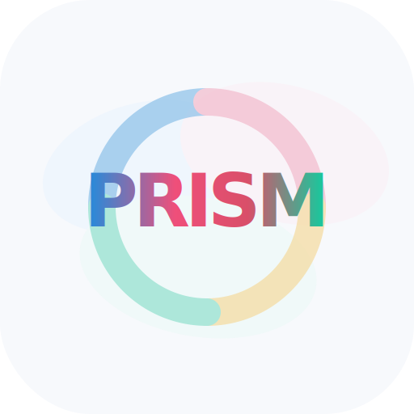

  

  <strong>PRISM: Precision and contact-rich Real-world Industrial Skill Dataset with Multimodal Sensing</strong>

  
  
  
  
  

PRISM is a large-scale multimodal dataset for contact-rich real-world industrial manipulation. It is designed to support robot learning in industrial scenarios where precise contact, force/torque regulation, tactile feedback, and multimodal perception are important.

## Overview

Most existing robot learning datasets focus on short-horizon and low-contact manipulation tasks, such as pick-and-place. These datasets are often insufficient for industrial assembly and other contact-rich operations, where robots must handle tight tolerances, sustained contact, friction, insertion, alignment, and force-sensitive interactions.

PRISM addresses this gap by collecting diverse industrial manipulation demonstrations with synchronized multimodal sensing. The dataset includes multi-view RGB-D observations, force/torque measurements, tactile signals, and robot-state information, providing a realistic benchmark for learning contact-rich manipulation policies.

## Dataset Highlights

- **25+** industrial manipulation tasks
- **5,000+** robot trajectories
- **5,000+** paired human demonstrations
- **45+** hours of demonstrations
- **~27M** images across visual and visuotactile streams
- Multi-view **RGB-D** sensing
- **6DoF force/torque** sensing
- **Tactile** and proprioceptive observations
- Multiple robot platforms and teleoperation interfaces

## Citation

BibTeX will be released soon.
